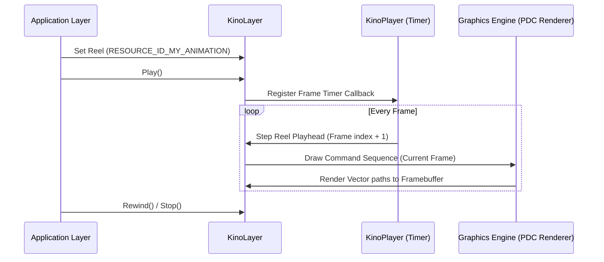

# Pebble OS & Application Animations Guide

This document describes how Pebble OS compiles, renders, and manages animations at the system level, and how apps like **Pebble Step Goal Plus** can use these mechanisms to render lightweight, high-performance animations on low-power memory-in-pixel (MIP) displays.

---

## 1. Vector Graphics Architecture (PDC Format)

To achieve smooth transitions without exhaustively consuming memory and CPU, Pebble OS uses vector-based graphics instead of heavy raster sheets (like GIFs).

### Pebble Draw Command (PDC)
PDC is a binary vector representation. When you add a vector resource (such as `.svg`) to a Pebble project, the SDK compiler converts it into a binary `.pdc` (or `.pdci` / `.pdcs` for sequences) file using the `svg2pdc` tool.

A `.pdc` file contains:
1.  **Header:** Identifies the file version and the size of the drawing canvas.
2.  **Draw Commands:** A sequence of commands that define:
    *   **Paths:** Lists of points outlining lines, polygons, or curves.
    *   **Circles:** Coordinates and radius.
    *   **Precise Styling:** Fill color, stroke color, and stroke width.

### Draw Command Sequences (`.pdcs`)
For animations, multiple vector frames are packaged into a single **Pebble Draw Command Sequence** (`.pdcs`) file. Each frame is a discrete list of draw commands representing a step in the animation. At runtime, the graphics engine iterates through these frames to draw them on the screen.

---

## 2. The Kino Animation Engine

Pebble OS's private firmware library implements **Kino** (Russian/German word for cinema), a vector animation player engine designed to play `.pdc` animations.

### Core Kino Types
*   `KinoReel`: Represents the animation sequence loaded from resources. It behaves like a film reel, keeping track of total frames, duration, and structure.
    *   `kino_reel_pdci`: Loads a static draw command image.
    *   `kino_reel_pdcs`: Loads a multi-frame draw command sequence.
*   `KinoLayer`: A specialized UI layer that draws and holds the state of a `KinoReel` playhead.
*   `kino_player`: An animator engine that registers timer tick callbacks to step through the reel.

### Execution Cycle


---

## 3. How Pebble OS Creates System Animations

Pebble OS registers system-wide events and hooks them up to compositor animations and system apps (like Alarms, Notifications, and Health).

### Empty Timeline (The Sloth)
1.  **State Check:** When entering the Timeline app, [timeline.c](file:///Users/dauletle/Development/pebble-step-goal-plus_pebble/src/window_progress.c) checks `timeline_model_is_empty()`.
2.  **App State:** The state changes to `TimelineAppStateNoEvents`.
3.  **Kino Playback:** The Timeline layer initializes `layer->end_of_timeline` with resource `RESOURCE_ID_END_OF_TIMELINE` (linked to `Pebble_50x50_Fin.svg` containing the sloth illustration).
4.  **Transition:** The compositor triggers a slide transition that fills the screen with the timeline color (`TIMELINE_FUTURE_COLOR` or `TIMELINE_PAST_COLOR`) while the sloth vector animation plays.

### Reaching a Goal (The Star Celebration)
1.  **Background Monitor:** The Step Goal background worker runs, calculating step increments and comparing them against target thresholds.
2.  **Threshold Match:** If a daily target is hit, the background worker triggers a milestone event or writes to the persistent store.
3.  **UI Alert:** When the foreground app receives the milestone event, it pushes a modal popup (`health_tracking_ui.c`) loaded with `RESOURCE_ID_REACHED_FITNESS_GOAL` (`Pebble_80x80_Reached_fitness_goal.svg`).
4.  **Haptics:** Concurrently, the vibe patterns are pulsed to signal achievement.

---

## 4. Implementing Animations in Pebble Step Goal Plus

Since third-party Pebble SDKs do not expose the private `Kino` API directly, apps use one of three public methods to achieve the same effect:

### Option A: App Resources PDC Sequence (Recommended)
You can include a `.pdc` sequence file in your `appinfo.json` resources and play it using the `gdraw_command_sequence` public APIs:

1.  **Declare in `appinfo.json`:**
    ```json
    "resources": {
      "media": [
        {
          "file": "images/celebration.pdc",
          "name": "RESOURCE_ID_CELEBRATION",
          "type": "raw"
        }
      ]
    }
    ```
2.  **Load and Render in C:**
    ```c
    #include <pebble.h>

    static GDrawCommandSequence *s_sequence;
    static int s_frame_index = 0;
    static AppTimer *s_timer;

    static void timer_callback(void *context) {
      Layer *layer = (Layer *)context;
      s_frame_index++;
      if (s_frame_index >= gdraw_command_sequence_get_num_frames(s_sequence)) {
        s_frame_index = 0; // Loop or stop
      }
      layer_mark_dirty(layer);
      s_timer = app_timer_register(33, timer_callback, layer); // ~30 fps
    }

    static void update_proc(Layer *layer, GContext *ctx) {
      GDrawCommandFrame *frame = gdraw_command_sequence_get_frame_by_index(s_sequence, s_frame_index);
      if (frame) {
        gdraw_command_frame_draw(ctx, s_sequence, frame, GPoint(10, 10));
      }
    }
    ```

### Option B: APNG / Bitmap Sequences
If vectors are not required, developers pack multiple PNG frames into an Animated PNG (APNG) file:
1.  **Declare in `appinfo.json`:**
    ```json
    {
      "file": "images/celebration_anim.png",
      "name": "RESOURCE_ID_CELEBRATION_ANIM",
      "type": "png",
      "characterRegex": ""
    }
    ```
2.  **Play via `GDrawCommand` / `GBitmapSequence`:**
    ```c
    static GBitmapSequence *s_sequence;
    static GBitmap *s_bitmap;
    static BitmapLayer *s_bitmap_layer;

    // Inside init:
    s_sequence = gbitmap_sequence_create_with_resource(RESOURCE_ID_CELEBRATION_ANIM);
    s_bitmap = gbitmap_create_as_sub_bitmap(gbitmap_sequence_get_bitmap(s_sequence), GRect(0,0,0,0));
    ```

### Option C: UI Property Animations (Translational/Rotational)
For sliding card layouts or moving progress bars, use `PropertyAnimation`:
```c
PropertyAnimation *prop_anim = property_animation_create_bounds_origin(
    (Layer *)s_progress_card, 
    &GRect(0, 168, 144, 100), // Start frame
    &GRect(0, 50, 144, 100)   // End frame
);
animation_set_duration((Animation *)prop_anim, 400);
animation_set_curve((Animation *)prop_anim, AnimationCurveEaseInOut);
animation_schedule((Animation *)prop_anim);
```
This moves UI layers smoothly and utilizes hardware-accelerated rendering routines.

---

## 5. Step-by-Step Tutorial: Creating and Integrating a New Vector Animation

This tutorial guides a junior developer through designing, compiling, and implementing a custom vector animation (PDC Sequence) from scratch, matching the implementation style used in Pebble OS and the foreground application.

### Step 1: Design and Prepare the Vector Asset (SVG)
Pebble's `svg2pdc` tool converts standard SVGs into binary vector instructions. However, it only supports a subset of SVG features. 

**SVG Design Constraints:**
*   **Dimensions:** Set your artboard/viewport to the size you want the image to render as (e.g., `80x80` pixels for goal celebrations, or `144x168` for full screen animations).
*   **Supported Elements:** Use only `<path>`, `<rect>`, `<circle>`, `<polyline>`, `<polygon>`, `<line>`, and `<g>` (groups).
*   **Unsupported Elements:** Do **not** use `<text>`, gradients, pattern fills, clip-paths, masks, filters, or effects.
*   **Colors:** Use solid colors. It is recommended to use the [8-bit GColor Palette](https://developer.rebble.io/guides/design-and-interaction/one-click-colors/) hex values to ensure color accuracy on the Pebble Time screen.

**Export Checklist in Illustrator/Inkscape:**
1.  **Convert to Paths:** Convert all text and stroke effects into plain paths (`Object to Path` in Inkscape, `Create Outlines` and `Outline Stroke` in Illustrator).
2.  **Ungroup Elements:** Select all objects and repeatedly ungroup them until no nested `<g>` elements remain.
3.  **Save as Clean SVG:** 
    *   *Inkscape:* Save as **Plain SVG**.
    *   *Illustrator:* Choose **Save As -> SVG** with profile **SVG Tiny 1.1** (or SVG 1.1 with styling set to "Presentation Attributes").

---

### Step 2: Compile SVGs into a PDC Animation Sequence
For animations, you will save each frame of your animation as a separate SVG file and pack them into a sequence.

1.  Create a folder named `my_animation_frames/` in your workspace.
2.  Save your SVG frames in sequence inside that folder using consistent numbering (e.g., `frame_00.svg`, `frame_01.svg`, `frame_02.svg`, etc.).
3.  Compile the sequence using the Pebble SDK `svg2pdc.py` python tool:
    ```bash
    python svg2pdc.py --sequence my_animation_frames/
    ```
    This tool output is a binary file named `my_animation_frames.pdc` containing all compiled frames wrapped into a sequence resource.
4.  Move the generated `my_animation_frames.pdc` to your project's resources directory: e.g., `resources/images/my_animation.pdc`.

---

### Step 3: Register the Resource in the Project
Add the PDC sequence resource mapping to the resource list inside your `appinfo.json` (or `package.json` depending on the build configuration):

```json
{
  "resources": {
    "media": [
      {
        "type": "raw",
        "name": "RESOURCE_ID_MY_CUSTOM_ANIMATION",
        "file": "images/my_animation.pdc"
      }
    ]
  }
}
```
*Note: We specify the type as `"raw"` because PDC sequences are loaded as binary blobs and read directly by the GDrawCommand APIs.*

---

### Step 4: Write the C Implementation for Playback
Below is the boilerplate C code structure for loading the PDC sequence, running the animation loop using a timer, rendering the correct frame based on elapsed time, and releasing memory.

```c
#include <pebble.h>

// Milliseconds between frame updates (e.g., 33ms is ~30 FPS, 50ms is ~20 FPS)
#define ANIMATION_DELTA_MS 33

static Window *s_main_window;
static Layer *s_canvas_layer;

static GDrawCommandSequence *s_sequence;
static AppTimer *s_timer;
static uint32_t s_elapsed_ms = 0;

// 1. Timer callback to advance elapsed time and request a redraw
static void next_frame_handler(void *context) {
  uint32_t total_duration = gdraw_command_sequence_get_total_duration(s_sequence);
  
  // Advance elapsed time
  s_elapsed_ms += ANIMATION_DELTA_MS;
  
  if (s_elapsed_ms >= total_duration) {
    s_elapsed_ms = 0; // Loop the animation
    
    // OR: To stop/destroy the animation after one run, do:
    // s_timer = NULL;
    // return;
  }
  
  // Trigger LayerUpdateProc redraw
  layer_mark_dirty(s_canvas_layer);
  
  // Re-register the timer callback
  s_timer = app_timer_register(ANIMATION_DELTA_MS, next_frame_handler, NULL);
}

// 2. Layer Update Procedure to render the current frame
static void canvas_update_proc(Layer *layer, GContext *ctx) {
  // Get the frame corresponding to the elapsed playback time
  GDrawCommandFrame *frame = gdraw_command_sequence_get_frame_by_elapsed(s_sequence, s_elapsed_ms);
  
  if (frame) {
    // Draw the frame centered or offset in the layer bounds
    GRect bounds = layer_get_bounds(layer);
    GPoint origin = GPoint((bounds.size.w - 80) / 2, (bounds.size.h - 80) / 2); // Center a 80x80 image
    
    gdraw_command_frame_draw(ctx, s_sequence, frame, origin);
  }
}

// 3. Window Load: Create UI and load resource
static void window_load(Window *window) {
  Layer *window_layer = window_get_root_layer(window);
  GRect bounds = layer_get_bounds(window_layer);
  
  // Create drawing canvas layer
  s_canvas_layer = layer_create(bounds);
  layer_set_update_proc(s_canvas_layer, canvas_update_proc);
  layer_add_child(window_layer, s_canvas_layer);
  
  // Load the compiled PDC sequence from resources
  s_sequence = gdraw_command_sequence_create_with_resource(RESOURCE_ID_MY_CUSTOM_ANIMATION);
  
  // Start the animation loop timer
  s_elapsed_ms = 0;
  s_timer = app_timer_register(ANIMATION_DELTA_MS, next_frame_handler, NULL);
}

// 4. Window Unload: Free memory and cancel timers
static void window_unload(Window *window) {
  // Cancel active timer
  if (s_timer) {
    app_timer_cancel(s_timer);
    s_timer = NULL;
  }
  
  // Destroy canvas layer
  layer_destroy(s_canvas_layer);
  
  // Destroy PDC sequence and free associated memory
  gdraw_command_sequence_destroy(s_sequence);
}
```
