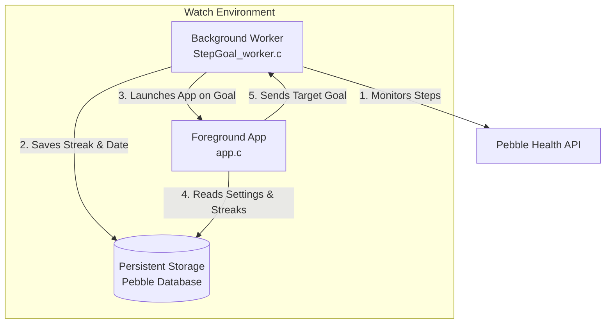
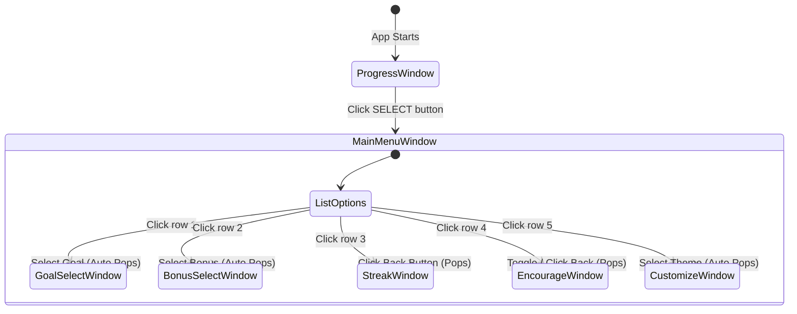

# Pebble Step Goals Plus: Architecture & Code Guide

Welcome! This guide is designed for developers who are new to Pebble watch programming. It explains how this project is structured, how the code runs on Pebble OS, and how the different components communicate with each other.

---

## 1. High-Level Architecture: The Dual-Process Model

Pebble apps can run two separate processes concurrently:
1. **Foreground App (`src/`)**: The user interface. It draws screens, handles button clicks, and lets users change settings. It only runs when the user explicitly opens the app.
2. **Background Worker (`worker_src/`)**: A tiny, headless C process. It runs in the background even when the watchface is active or other apps are open. It is restricted to **10.5 KB of RAM** and cannot draw anything on the screen.



### Process Communication
Because they run in different memory spaces, they communicate in two ways:
* **Persistent Storage**: A shared key-value database built into Pebble OS. When the app writes settings to storage, the worker can read them instantly.
* **AppWorkerMessage**: A tiny 16-byte message packet sent in real-time. For example, when you change your daily step goal in the menu, the app sends a packet to the worker to update its targets.

---

## 2. Navigation Flow & Window Stack

Pebble OS manages screens using a **Window Stack**. Pushing a window displays it; pressing the physical **Back button** pops the top window and reveals the previous screen.



---

## 3. Detailed Component Guide

### 1. Main Entry & Helpers (`src/app.c`)
The main entry point starts the background worker if it isn't running and determines which window to show:
* **Worker Launch**: If the background worker detects you met your goal, it launches the app with the reason `APP_LAUNCH_WORKER`. The app handles this by showing the celebration window ([window_goal.c](file:///Users/dauletle/Development/pebble-step-goal-plus_pebble/src/window_goal.c)).
* **Standard Launch**: If you clicked the app icon in the watch menu, it opens your progress dashboard ([window_progress.c](file:///Users/dauletle/Development/pebble-step-goal-plus_pebble/src/window_progress.c)).

### 2. Progress Dashboard (`src/window_progress.c`)
This screen draws the main dashboard. It uses a custom **Layer Update Proc** to draw the filling background:
* **Bottom-Up Fill**: It calculates `percent = (steps * 100) / total_goal`. It then fills the bottom `fill_height` of the screen with your selected theme color, leaving the top portion white.
* **Live Updates**: It subscribes to health service events (`HealthEventMovementUpdate`). When you take a step, Pebble OS fires a callback, the code fetches your new steps, and calls `layer_mark_dirty()`, which redraws the screen instantly.
* **Milestones**: It checks your steps against 50% and 75% targets. Once crossed, it triggers a vibration reminder (`vibes_short_pulse()` or `vibes_double_pulse()`) and marks that milestone as "vibrated today".

### 3. Streak Reset Logic (`get_local_epoch_day`)
To calculate daily streaks, we need a reliable way to know if "today" is the day after "yesterday" in the user's local timezone.
Instead of using UTC division (which drifts based on timezone offsets), we convert the Gregorian date (`Year, Month, Day`) from `localtime()` into a **Julian/Local Epoch Day**:
```c
int get_local_epoch_day() {
  time_t now = time(NULL);
  struct tm *t = localtime(&now);
  int y = t->tm_year + 1900;
  int m = t->tm_mon + 1;
  int d = t->tm_mday;
  if (m < 3) {
    y--;
    m += 12;
  }
  return 365 * y + y/4 - y/100 + y/400 + (153*m+3)/5 + d;
}
```
* **Consecutive Days**: If `today_epoch == last_met_epoch + 1`, you met your goal yesterday, so we increment your streak!
* **Streak Broken**: If `today_epoch > last_met_epoch + 1`, more than a day passed, so we reset your streak to `1`.

### 4. Background Worker (`worker_src/StepGoal_worker.c`)
The worker runs a continuous loop. 
* It subscribes to health event updates to check your steps today.
* If you hit your target goal, it checks the epoch day, updates your streak counts, updates your best record, saves them to persistent storage, and calls `worker_launch_app()` to open the celebration window.

---

## 4. Multi-Screen Layout Sizing

Pebble watch screens vary by platform:
* **Basalt** (Pebble Time): 144 x 168 px
* **Chalk** (Pebble Time Round): 180 x 180 px (circular)
* **Emery** (Pebble Time 2): 200 x 228 px

To support these different screen sizes without writing custom code for each watch, we use **dynamic layout bounds**:
```c
// Get the size of the screen we are running on
Layer *window_layer = window_get_root_layer(window);
GRect bounds = layer_get_bounds(window_layer);

// Center a card that takes 80% width and 48% height
int card_w = (bounds.size.w * 80) / 100;
int card_h = (bounds.size.h * 48) / 100;
GRect card_rect = GRect(
  (bounds.size.w - card_w) / 2, 
  (bounds.size.h - card_h) / 2, 
  card_w, 
  card_h
);
```
Using percentages of `bounds.size.w` and `bounds.size.h` ensures that cards, fonts, and text align beautifully on any Pebble watch screen automatically.
